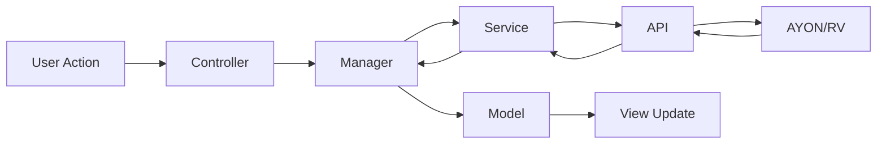

# AYON Review Browser

[](https://ynput.io/ayon/)
[](https://opensource.org/licenses/Apache-2.0)
[](https://github.com/kyadarimahesh/ayon-review-browser/releases)

A powerful AYON addon providing a Qt-based desktop application for browsing, filtering, and reviewing media submissions with deep OpenRV integration for professional review workflows.

## 🎯 Features

### Core Capabilities
- **📊 Dual-Tab Interface**: Browse all project versions or work with curated playlists
- **🔍 Advanced Filtering**: Multi-criteria filtering with persistent state per tab (status, task type, reviewer, date)
- **💬 Activity Panel**: Real-time comments, status changes, and activity tracking with rich HTML formatting
- **🎬 OpenRV Integration**: Seamless media playback with automatic activity synchronization and event-driven updates
- **📸 Thumbnail Previews**: Dynamic thumbnail loading with caching and lazy loading
- **📋 Playlist Management**: Browse and manage review playlists with version grouping
- **🔄 Version History & Comparison**: Switch between product versions with side-by-side comparison in RV
- **📥 Local Review Sessions**: Download reviewables for offline review with progress tracking
- **🎨 Mode-Aware Commenting**: Different behavior in Browser vs RV mode with RV annotation export
- **🔀 Representation Switching**: Switch between different representations (.exr, .mp4, etc.) in RV
- **⚙️ Fully Configurable**: All settings configurable via AYON server settings

### Workflow Integration
```
Project Selection → Filter Versions → View Activity → Load in RV → Review & Comment → Status Update
```

## 🔄 Complete Review Workflow

### Overview: Two Major Purposes

The AYON Review Browser serves two primary functions in the production pipeline:

#### 1. **Review Submissions** - Reviewing Published Work
Artists publish their work (renders, plates, composites) via **ayon-review-submitter**, which creates versions in AYON. Reviewers then use the Review Browser to:
- Browse all published versions across the project
- Filter by status, task type, date, reviewer
- View version details and activity history
- Load media in OpenRV for detailed review
- Provide feedback via comments and status changes

#### 2. **Playlists** - Curated Review Sessions
Supervisors create playlists (collections of versions) for organized review sessions. The Review Browser allows:
- Browse curated playlists
- View all versions in a playlist with version history
- Load multiple versions for comparison
- Conduct structured review meetings
- Track review progress per playlist

### End-to-End Workflow

```
┌─────────────────────────────────────────────────────────────────┐
│                    SUBMISSION PHASE                              │
│  (ayon-review-submitter - Separate Tool)                        │
└─────────────────────────────────────────────────────────────────┘
                              ↓
    Artist works in RV → Loads media (renders, plates, etc.)
                              ↓
    Creates review submission via submitter tool
                              ↓
    Submitter stores version metadata in AYON:
    - version_id (stored in RV source properties)
    - representation_id
    - file_path
    - Product info (render, plate, composite)
                              ↓
    Published to AYON Server as "version"
                              ↓
┌─────────────────────────────────────────────────────────────────┐
│                    REVIEW PHASE                                  │
│  (ayon_review_browser - This Tool)                             │
└─────────────────────────────────────────────────────────────────┘
                              ↓
    Reviewer opens Review Browser
                              ↓
    ┌─────────────────────────────────────────────────┐
    │  OPTION A: Review Submissions Tab               │
    │  - Browse ALL published versions                │
    │  - Filter by status/task/date                   │
    │  - Select version → View activity               │
    │  - Right-click → "Open in RV"                   │
    │  - RV loads media with version tracking         │
    │  - Activity panel shows version details         │
    │  - Add comments → Stored in AYON                │
    │  - Change status → Updates AYON                 │
    └─────────────────────────────────────────────────┘
                              OR
    ┌─────────────────────────────────────────────────┐
    │  OPTION B: Lists Tab (Playlists)               │
    │  - Browse curated playlists                     │
    │  - Select playlist → View versions              │
    │  - Right-click → "Open in RV"                   │
    │  - Load multiple versions for comparison        │
    │  - Navigate between versions in RV              │
    │  - Activity panel auto-updates per version      │
    │  - Add comments to each version                 │
    └─────────────────────────────────────────────────┘
                              ↓
    Feedback stored in AYON → Artist sees comments
```

### Key Integration Points

#### Submission → Review Connection
1. **Submitter** creates version with metadata stored in RV source properties:
   ```python
   {source}.ayon.version_id = "uuid-from-ayon"
   {source}.ayon.representation_id = "uuid"
   {source}.ayon.file_path = "/path/to/file.exr"
   ```

2. **Review Browser** reads this metadata when loading .rv workfiles:
   - Detects .rv file extension
   - Loads all sources from workfile
   - Reads version_id from each source's properties
   - Maps each source to its AYON version
   - Comments go to the correct version (not workfile)

#### RV Workfile Support
When loading .rv workfiles (created by submitter):
- Browser detects multiple sources in workfile
- Reads each source's `version_id` from RV properties
- Creates source mapping: `{source_group} → {version_id}`
- Activity panel updates based on current active source
- Comments automatically target the active source's version

**Example:**
```
workfile.rv contains:
  - sourceGroup000001 (plate v001) → version_id: "abc123"
  - sourceGroup000002 (render v003) → version_id: "def456"
  - sourceGroup000003 (comp v002) → version_id: "ghi789"

When user navigates to sourceGroup000002:
  → Activity panel shows render v003 details
  → Comments go to render v003 (not workfile)
```

## 📋 Requirements

- **AYON Server**: >=1.0.0
- **AYON Core**: Latest
- **Python**: >=3.9
- **Qt**: PySide2 >=6.0.0 (or qtpy compatibility layer)
- **OpenRV**: Optional (for advanced review features)
- **AYON Applications Addon**: For launching RV from tray

## 🚀 Installation

### Method 1: AYON Server UI (Recommended)
1. Download the latest release `.zip` from [Releases](https://github.com/kyadarimahesh/ayon-review-browser/releases)
2. Open AYON Server UI
3. Navigate to **Studio Settings → Addons**
4. Click **Upload Addon**
5. Select the downloaded `.zip` file
6. Enable the addon for your projects

### Method 2: Manual Installation
```bash
# Clone the repository
git clone https://github.com/kyadarimahesh/ayon-review-browser.git
cd ayon-review-browser

# Create package
python create_package.py

# Upload package/ayon_review_browser-0.1.3.zip to AYON server
```

### Method 3: Standalone Development
```bash
# Install dependencies
pip install -r client/ayon_review_browser/requirements.txt

# Set environment variables
export AYON_SERVER_URL="http://your-ayon-server:5000"
export AYON_API_KEY="your-api-key"

# Run application (from client/ayon_review_browser directory)
python run_app.py
```

### Method 4: Launch from AYON Tray
1. Install addon via AYON Server UI
2. Right-click AYON tray icon
3. Select **Reviewer** menu item
4. Review Browser launches with OpenRV

## ⚙️ Configuration

### Server Settings

Navigate to **Studio Settings → Addons → Review Browser** to configure:

#### RV Integration
- **RV Executable Path**: Path to RV executable (leave empty for auto-detection)
- **Auto-dock Activity Panel**: Automatically dock activity panel to RV window

#### Filter Settings
- **Default Date Filter**: Default date range (ALL, TODAY, THIS_WEEK, THIS_MONTH)
- **Persist Filters Per Project**: Save filter state per project

#### UI Settings
- **Thumbnail Size**: Thumbnail size in pixels (50-300, default: 100)
- **Auto-refresh Interval**: Automatic data refresh in seconds (0=disabled)
- **Show Version Thumbnails**: Display thumbnails in tables

#### Activity Panel Settings
- **Max Activities Display**: Maximum activities to show (10-500, default: 50)
- **Enable Activity Animations**: Show loading animations

## 📖 Usage

### Basic Workflow

#### 1. Browse Review Submissions
1. Launch Review Browser from AYON tray menu
2. Select project from dropdown
3. Browse versions in **Review Submissions** tab
4. Apply filters (status, task type, reviewer, date)
5. Click version to view activity and comments

#### 2. Work with Playlists
1. Switch to **Lists** tab
2. Select playlist from list view
3. View playlist versions with version history
4. Switch between versions using dropdown
5. Load multiple versions in RV for comparison

#### 3. Review in OpenRV
1. Right-click version(s) → **Open in RV**
2. Select representations in RV Media Selection Dialog
   - Choose version from dropdown
   - Select representations (checkboxes)
   - Set representation priority order
3. RV launches with media loaded
4. Activity panel automatically docks to RV
5. Navigate sources - activity updates automatically
6. Switch representations via Representations tab
7. Add comments with RV annotations

#### 4. Local Review Session
1. Right-click playlist → **Local Review Session**
2. Preview available reviewables in tree dialog
3. Download files with progress tracking
4. RV loads with local files for offline review
5. Comments sync back to AYON when online

#### 5. Version Comparison
1. Select version in Lists tab
2. Switch to different version using dropdown
3. Dialog asks: "Compare or Replace?"
4. If Compare: RV creates side-by-side stack and layout
5. Use ( ) keys to navigate between versions
6. Activity panel updates for each version

### Advanced Usage

#### Activity Panel Modes
- **Browser Mode**: Panel docked to Review Browser window
- **RV Mode**: Panel detached and docked to RV window
- **Toggle**: Click "SWITCH TO RV" / "SWITCH TO BROWSER" button
- **Representations Tab**: Switch between different file formats in RV mode

#### RV Annotation Export
```python
# Annotations automatically exported when commenting in RV mode
# Uses RVAnnotationManager to extract text and marked frames
# Exports frames as JPEG images attached to comments
```

#### Version Comparison Workflow
```python
# Managed by RVComparisonManager
# Creates RVStackGroup for overlay comparison
# Creates RVLayoutGroup for side-by-side view
# Preserves source mapping for both versions
```

#### Custom Filtering
```python
from src.controllers.filter_strategy import FilterStrategy

class CustomFilterStrategy(FilterStrategy):
    def apply_filters(self, data, filters):
        # Custom filtering logic
        return filtered_data
```

## 🏗️ Architecture

### Components

```
ayon_review_browser/
├── client/ayon_review_browser/
│   ├── api/
│   │   ├── ayon/                      # AYON API integration
│   │   │   ├── base_client.py         # GraphQL client
│   │   │   ├── ayon_client_api.py     # Unified API facade
│   │   │   ├── project_service.py     # Projects, lists, versions
│   │   │   ├── version_service.py     # Version details, thumbnails
│   │   │   ├── activity_service.py    # Comments, activities
│   │   │   ├── task_service.py        # Task data
│   │   │   └── file_service.py        # File upload/download
│   │   └── rv/                        # RV API integration
│   │       ├── rv_api.py              # CRUD operations (Source, Stack, Layout managers)
│   │       ├── rv_operations.py       # Media loading, monitoring, events
│   │       ├── rv_registry.py         # Global instance management
│   │       ├── rv_source_events.py    # Event system (frame, view, stack changes)
│   │       └── rv_annotation_manager.py # Annotation extraction and export
│   ├── services/
│   │   └── data_service.py            # Data transformation and caching
│   ├── src/
│   │   ├── controllers/               # UI logic
│   │   │   ├── advanced_filter_controller.py
│   │   │   ├── filter_manager.py
│   │   │   ├── filter_strategy.py
│   │   │   ├── lists_controller.py
│   │   │   └── table_filter_controller.py
│   │   ├── managers/                  # Component managers
│   │   │   ├── activity_panel_manager.py
│   │   │   ├── activity_worker.py     # Background activity loading
│   │   │   ├── table_manager.py
│   │   │   ├── rv_integration_manager.py
│   │   │   ├── rv_comparison_manager.py # Version comparison
│   │   │   ├── representation_manager.py # Rep switching
│   │   │   ├── version_comparison_dialog.py
│   │   │   └── preferences_manager.py
│   │   ├── models/                    # Data models
│   │   │   └── table_models.py        # Review & List table models
│   │   └── views/                     # UI components
│   │       ├── main_window.py
│   │       ├── rv_style.py            # RV-specific styling
│   │       └── widgets/
│   │           ├── filter_widgets.py
│   │           └── standalone_search_bar/
│   ├── utils/                         # Utilities
│   │   ├── comment_handler.py         # Mode-aware commenting
│   │   ├── date_utils.py              # Date parsing and filtering
│   │   ├── download_progress_dialog.py
│   │   ├── reviewables_dialog.py
│   │   └── rv_media_dialog.py         # RV media selection
│   ├── ui/                            # Qt Designer files
│   │   ├── designs/                   # .ui files
│   │   └── generated/                 # Generated Python UI
│   ├── icons/                         # Emoji-based icons
│   ├── addon.py                       # Addon registration (TrayReviewAddon)
│   ├── run_app.py                     # Entry point
│   ├── version.py                     # Version info
│   └── requirements.txt               # Dependencies
└── server/
    ├── settings/
    │   ├── __init__.py
    │   └── main.py                    # Server settings schema
    └── __init__.py                    # ReviewBrowserAddon
```

### Data Flow



### Design Patterns

- **MVC Pattern**: Clean separation of data, UI, and logic
- **Strategy Pattern**: Pluggable filter strategies per tab
- **Observer Pattern**: Qt signals/slots for event-driven updates
- **Manager Pattern**: Coordinated component management
- **Service Layer**: API abstraction and business logic
- **Registry Pattern**: Global RV operations instance
- **Facade Pattern**: Unified API interfaces

## 🔧 API Reference

### AYON Client API

#### AyonClient (Unified API)
```python
from api.ayon.ayon_client_api import AyonClient

client = AyonClient()

# Projects and Lists
projects = client.get_projects()
lists = client.get_lists(project_name)
list_items = client.get_list_items(project_name, list_id)
versions = client.get_list_versions(project_name, list_id)  # With version history

# Versions
details = client.get_version_details(project_name, version_id)
thumbnail = client.get_version_thumbnail_data(project_name, version_id)
client.update_version_status(project_name, version_id, "approved")

# Activities
client.create_comment_on_version(
    project_name, version_id, "Looks great!", "john.doe", ["annotation.jpg"]
)
html = client.process_version_activities(project_name, version_id, status_colors)

# Tasks
tasks = client.get_tasks(project_name, date_filter="THIS_WEEK")
count = client.get_recent_tasks_count(project_name, days=7)

# Files
file_id = client.upload_file(project_name, file_path, activity_id)
local_path = client.download_file(project_name, file_id)
```

### RV API

#### RVAPI (CRUD Operations)
```python
from api.rv.rv_api import RVAPI

rv_api = RVAPI()

# Sources
sources = rv_api.sources.list()
source = rv_api.sources.create(["file.exr"])
rv_api.sources.delete(source)

# Stacks (for comparison)
stack = rv_api.stacks.create("comparison", [source1, source2])
rv_api.stacks.add_layer(stack, source3)

# Layouts (side-by-side)
layout = rv_api.layouts.create("review", [source1, source2], mode="row")
rv_api.layouts.set_mode(layout, "packed")

# Sequences
seq = rv_api.sequences.create("sequence", [source1, source2, source3])
```

#### RVOperations (High-level)
```python
from api.rv.rv_operations import RVOperations

rv_ops = RVOperations()

# Load media with version tracking
rv_ops.load_media_with_versions(
    media_data=[{'path': 'file.exr', 'version_id': 'uuid', 'row_data': {...}}],
    clear_session=True
)

# Start event monitoring
rv_ops.start_source_monitoring()

# Switch representation
rv_ops.switch_representation(new_path, row_data, representations)

# Export annotations
annotation_files = rv_ops.export_annotations()
```

#### RVAnnotationManager
```python
from api.rv.rv_annotation_manager import RVAnnotationManager

ann_mgr = RVAnnotationManager()

# Get text annotations
text = ann_mgr.get_text_annotations()

# Get summary
summary = ann_mgr.get_annotation_summary()
# Returns: {'has_annotations': bool, 'frame_count': int, 'text_annotations': str}

# Export marked frames
ann_mgr.export_marked_frames("/output/path", "annotated.####.jpeg") activities
html = client.process_version_activities(
    project_name, version_id, status_colors
)
```

### RV API

#### RVAPI
```python
from api.rv.rv_api import RVAPI

rv_api = RVAPI()

# Create source
source = rv_api.sources.create(["path/to/file.exr"])

# Create stack for comparison
stack = rv_api.stacks.create("comparison", [source1, source2])

# Create layout
layout = rv_api.layouts.create("review", [source1, source2], mode="row")
```

#### RVOperations
```python
from api.rv.rv_operations import RVOperations

rv_ops = RVOperations()

# Load media with version tracking
rv_ops.load_media_with_versions(
    media_data=[
        {
            'path': 'file.exr',
            'version_id': 'uuid',
            'row_data': {...}
        }
    ],
    clear_session=True
)

# Start monitoring
rv_ops.start_source_monitoring()

# Export annotations
annotation_files = rv_ops.export_annotations()
```

## 🐛 Troubleshooting

### Application Won't Start
**Issue**: ImportError or module not found
**Solution**:
- Verify Python 3.9+ installed
- Install dependencies: `pip install PySide2>=6.0.0`
- Check Qt installation: `python -c "from PySide2.QtWidgets import QApplication"`
- If using qtpy: `pip install qtpy`

### Cannot Connect to AYON
**Issue**: "Failed to load project data"
**Solution**:
- Verify `AYON_SERVER_URL` environment variable
- Check `AYON_API_KEY` is valid
- Test connection: `curl $AYON_SERVER_URL/api/info`
- Verify network access to AYON server

### RV Integration Not Working
**Issue**: "Open in RV" disabled or activity panel not updating
**Solution**:
- Ensure OpenRV is installed and configured in AYON Applications
- Check RV is accessible: `python -c "import rv.commands; print('OK')"`
- Verify AYON OpenRV addon is enabled
- Check RV event bindings in RV console
- Restart RV integration: Toggle activity panel mode

### Slow Performance
**Issue**: Slow loading or laggy UI
**Solution**:
- Reduce thumbnail size in settings
- Disable auto-refresh
- Clear thumbnail cache: Delete `~/.ayon/cache/thumbnails`
- Check network connection speed
- Reduce max activities display

### Activity Panel Not Updating
**Issue**: Activity panel shows stale data in RV mode
**Solution**:
- Check RV event bindings: Verify `after-graph-view-change` fires
- Restart RV integration: Toggle activity panel mode
- Check source mapping: `rv_ops.source_mapping` should contain current source
- Verify version_id in source mapping matches AYON version
- Check RVSourceEvents monitoring is active

### Version Comparison Not Working
**Issue**: Comparison dialog doesn't appear or comparison fails
**Solution**:
- Ensure both versions have same representation type
- Check RV is running and accessible
- Verify RVComparisonManager is initialized
- Check console for error messages
- Try "Replace" mode first to verify basic loading works

## 🤝 Contributing

Contributions are welcome! Please:

1. Fork the repository
2. Create a feature branch (`git checkout -b feature/amazing-feature`)
3. Commit your changes (`git commit -m 'Add amazing feature'`)
4. Push to the branch (`git push origin feature/amazing-feature`)
5. Open a Pull Request

### Development Setup
```bash
# Clone repository
git clone https://github.com/kyadarimahesh/ayon-review-browser.git
cd ayon-review-browser

# Install in development mode
pip install -e client/

# Run tests (when available)
python -m pytest tests/
```

## 📝 License

This project is licensed under the Apache License 2.0 - see the [LICENSE](LICENSE) file for details.

## 🙏 Acknowledgments

- AYON Team for the amazing pipeline platform
- OpenRV community for the powerful review tool
- Qt Project for the excellent UI framework
- Contributors and testers

## 📞 Support

- **Issues**: [GitHub Issues](https://github.com/kyadarimahesh/ayon-review-browser/issues)
- **AYON Community**: [AYON Discord](https://discord.gg/ayon)

## 🗺️ Roadmap

### Current Version (0.0.1)
- ✅ Dual-tab interface with persistent filters
- ✅ OpenRV integration with activity synchronization
- ✅ Version history and switching with dropdown
- ✅ Version comparison (side-by-side in RV)
- ✅ Representation switching in RV
- ✅ Local review sessions with reviewables
- ✅ Mode-aware commenting with RV annotation export
- ✅ Activity panel with 3 modes (Browser/RV/Transition)
- ✅ RV annotation manager for text and frame export
- ✅ Configurable server settings

### Upcoming Features


---

**Made with ❤️ for the AYON community**
